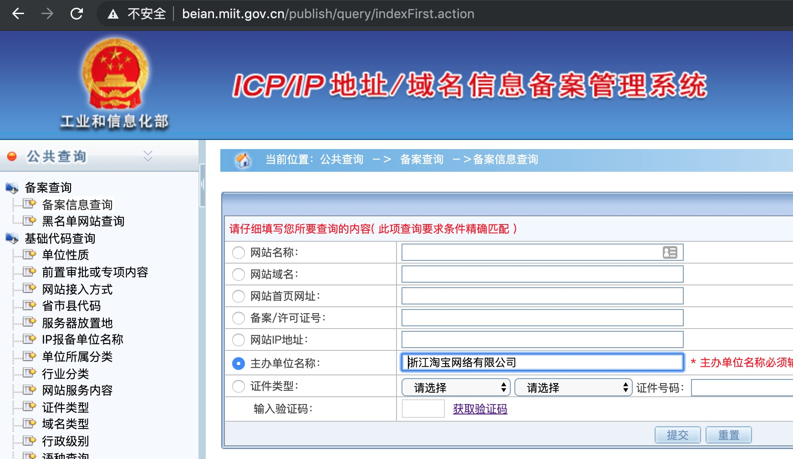
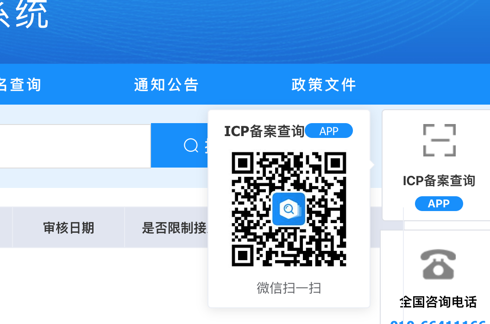

## 一个很水的备案查询的爬虫
### 写在前面


备案查询是资产收集中很重要的一步，能自动化就美滋滋，这里验证码识别服务搭建在自己的服务器上，大佬们不要hack，
验证码的识别率达到90%已经，用起来基本没啥问题

验证码训练参考：https://github.com/kerlomz/captcha_trainer

验证码部署参考：https://github.com/kerlomz/captcha_platform
### 使用说明
建议在py3环境下食用

`pip install -r requirements.txt`

使用方法：
`python beian.py "浙江淘宝网络有限公司"`


有大佬有兴趣可以自己打个pip包，用起来更方便，欢迎提issue


### 2020.11.13 适配
这个备案查询网站改版了，验证码变成滑动的了，不过又开放了一个APP产品，这个app虽然也有验证码，
不过有bug，可以绕过


#### 使用方式
```python
python3 beian.py --comp=中国铁路上海局集团有限公司
or
python3 beian.py --mode=file --comp_f_path=test.txt
```
